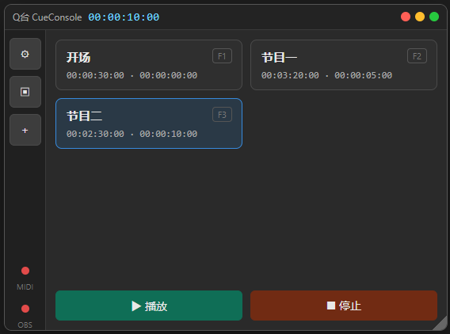
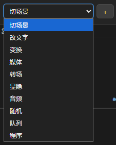
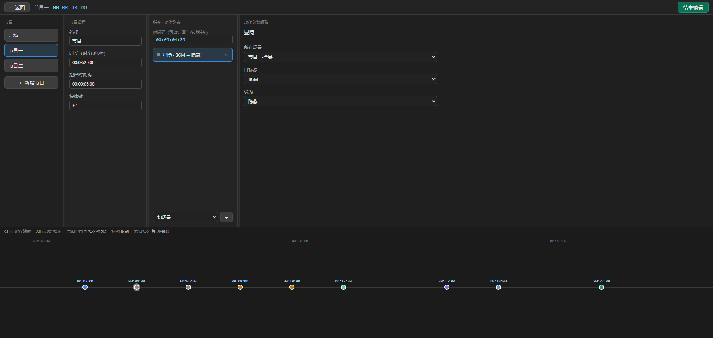

# Q台 CueConsole

> 节目控台：可视化时间轴编排 cue，到点自动直驱 OBS + 发 MTC 时间码带灯控台同步。

**Q台**（Q = cue 的圈内叫法）把直播节目的三路同步——画面、音乐、灯光——收进**一条时间轴**：编辑器里排好 cue，双击节目，主时钟到点触发，画面切镜、切片、文字与灯光走同一张时间码，帧精确（30fps 非丢帧），不翻车。

替代过去的散装工具链：ASS 自动化 + P1 播放器 + 灯控台手动追。



## 它能干什么

- **可视化时间轴编辑器**——拖拽 cue、直接编辑时间码、每个节目带起始时间码偏移
- **内置主时钟**——自己发 MTC 时间码，按帧到点触发 cue（30fps 非丢帧）
- **直驱 OBS**——9 种动作：`切场景` / `媒体` / `转场` / `显隐` / `改文字` / `音频` / `程序` / `随机` / `变换`
- **灯控台跟随**——灯光台或 DAW（Reaper 等）追同一时间码，三路同源



## 编辑器

节目卡片 → 时间轴 → cue 参数三栏布局；动作参数按类型联动 OBS 真实资源（场景/源/转场下拉全从 websocket 取）。



## 架构（三层）

```
timeline.json   编辑层：相对时间 + 起始偏移，不绑任何设备
   → compile.py 帧精确编译（t+offset + 参数规范化）
cues.json       执行层：{tc, action, params}
   → mtc_to_obs.py / bridge_server.py  到点直驱 OBS + 发 MTC
```

## 环境要求

- Windows
- Python 3.12
- OBS Studio（启用 obs-websocket，默认端口 4455）
- （可选）loopMIDI + 灯控台 / DAW，用于 MTC 追同步

## 快速开始

1. 安装 Python 3.12（勾选 **Add python.exe to PATH**）
2. 双击 `setup_env.bat` —— 自动在项目目录建 venv 并装依赖
3. 双击 `start_bridge.bat` —— 启动本地桥（编辑器 ↔ OBS）
4. 浏览器打开 `editor/index.html`
5. **双击节目卡片** → 主时钟开始发 MTC，cue 到点直驱 OBS

## 目录结构

```
bridge_server.py   本地桥 + 内置主时钟
mtc_to_obs.py      引擎（MTC 解析 + 9 动作）
compile.py         编译器（timeline.json → cues.json）
mtc_sender.py      独立 MTC 发码器
editor/            Web 编辑器界面
examples/          样例 timeline.json / cues.json
tests/             测试
```

## 进度

**v0.1** —— 核心链路真机验证通过（OBS 直驱 cue 触发 + Reaper MTC 追同步）。

路线图：
- `light` 动作（直触发灯控台 cue）
- 媒体播放时间轴增强（波形显示 + 参数）
- 手动抢控（暂停/跳过/紧急停止，快捷键可配置）
- 桌面化打包（Web 内核 + Electron 壳，双击即用）

## English

**Q台 (CueConsole)** — a timeline-based cue console for live shows. Edit cues on a visual timeline; the built-in master clock sends MTC timecode and fires cues frame-accurately (30fps ND) straight into OBS (scenes / media / text / visibility / transitions / audio / exec / random / transform), while lighting desks or DAWs chase the same timecode. Replaces the classic ASS-automation + media-player + manual-chase toolchain with one timeline. Windows + Python 3.12 + OBS with obs-websocket; double-click `setup_env.bat` then `start_bridge.bat`, open `editor/index.html`, and double-click a program card to run the show.

## 联系 / Contact

业务合作与部署咨询（团播直播间节目控台 / SOP 搭建）：


## License

MIT
